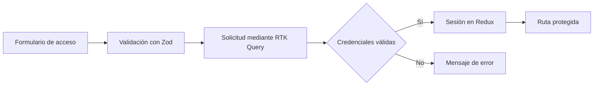

<div align="center">
  

  <h1>PenguinTech Web</h1>

  <p>
    Plataforma web de gestión gastronómica para centralizar la operación,
    administración y control de un negocio desde una única interfaz.
  </p>

  <p>
    <strong>React · TypeScript · Vite · Material UI · Redux Toolkit</strong>
  </p>
</div>

---

## Descripción

PenguinTech Web es la aplicación frontend de un sistema integral de gestión
gastronómica. Su propósito es reunir en una experiencia consistente los
procesos centrales de un establecimiento: pedidos, inventario, recetas,
compras, facturación y administración operativa.

La aplicación está diseñada con una arquitectura modular orientada a
funcionalidades. Esta separación mantiene aisladas las reglas de cada dominio,
centraliza la configuración transversal y facilita que la interfaz conserve un
lenguaje visual uniforme.

## Flujo de autenticación



## Tecnologías

| Área | Tecnología | Responsabilidad |
| --- | --- | --- |
| Interfaz | React 19 | Composición de vistas y componentes |
| Lenguaje | TypeScript | Tipado estático del código |
| Construcción | Vite 8 | Entorno de desarrollo y build de producción |
| Diseño | Material UI 9 | Componentes, tema y sistema visual |
| Estado | Redux Toolkit | Estado global y sesión |
| Datos | RTK Query | Ciclo de solicitudes y estados asíncronos |
| Formularios | React Hook Form | Control y envío de formularios |
| Validación | Zod | Esquemas y mensajes de validación |
| Navegación | React Router | Enrutamiento público y protegido |
| Iconografía | Iconify | Iconos de la interfaz |
| Calidad | ESLint | Análisis estático del código |

## Estructura del proyecto

```text
src/
├── app/
│   ├── providers/        # Proveedores globales de la aplicación
│   ├── router/           # Rutas, navegación y control de acceso
│   ├── store/            # Configuración y hooks tipados de Redux
│   └── theme/            # Identidad visual y personalización de Material UI
├── assets/
│   └── logos/            # Recursos gráficos de PenguinTech
├── features/
│   ├── auth/
│   │   ├── api/          # Servicio de autenticación
│   │   ├── components/   # Componentes propios del acceso
│   │   ├── pages/        # Páginas del módulo
│   │   ├── schemas/      # Reglas de validación
│   │   ├── store/        # Estado y acciones de sesión
│   │   └── types/        # Contratos TypeScript
│   └── dashboard/
│       ├── components/   # Indicadores y vistas operativas
│       ├── data/         # Datos de presentación del panel
│       ├── pages/        # Página principal del módulo
│       └── types/        # Contratos del dashboard
├── layouts/
│   ├── AuthLayout/       # Estructura visual de autenticación
│   └── MainLayout/       # Header, sidebar y contenido autenticado
├── shared/
│   ├── components/       # Componentes reutilizables
│   └── pages/            # Páginas compartidas entre módulos
├── App.tsx               # Componente raíz
└── main.tsx              # Punto de entrada y montaje de React
```

### Criterio de organización

- `app` concentra la infraestructura transversal que conecta toda la
  aplicación.
- `features` agrupa cada dominio funcional con sus componentes, datos, estado,
  validaciones y tipos.
- `layouts` define estructuras visuales compartidas entre páginas.
- `shared` contiene piezas reutilizables sin dependencia de un dominio
  específico.
- `assets` almacena la identidad gráfica y los recursos estáticos.

## Ejecución local

### Requisitos

- Node.js 22
- pnpm 11

### Instalación

```bash
pnpm install
```

### Desarrollo

```bash
pnpm dev
```

### Build de producción

```bash
pnpm build
```

### Análisis estático

```bash
pnpm lint
```

## Acceso de demostración

El entorno de desarrollo incluye las siguientes credenciales:

```text
Correo:     demo@penguintech.com
Contraseña: Penguin123!
```

Estas credenciales pertenecen exclusivamente al flujo simulado incluido en el
frontend.

## Scripts disponibles

| Comando | Descripción |
| --- | --- |
| `pnpm dev` | Inicia el servidor local con recarga en tiempo real |
| `pnpm build` | Valida TypeScript y genera la distribución de producción |
| `pnpm lint` | Ejecuta el análisis estático del proyecto |
| `pnpm preview` | Sirve localmente el resultado del build |

## Licencia

Copyright © 2026 PenguinTech. Todos los derechos reservados.

Este software es propietario. Su uso, copia, modificación o distribución
requiere autorización expresa de PenguinTech. Consulte el archivo
[LICENSE](./LICENSE) para conocer los términos completos.
